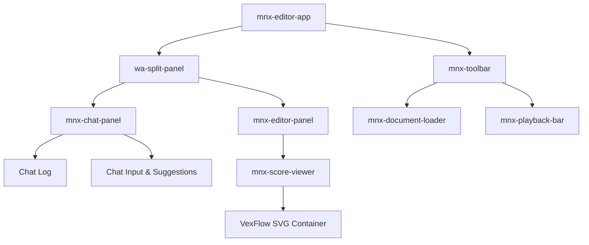

# UX Layout Specification: AI-First MNX Music Editor

This document defines the user interface (UI) and user experience (UX) layout for the MNX Music Editor, built around a pure Lit/Web Components stack with Web Awesome elements. 

The design is minimal, modern, and built for organic growth, prioritizing a glassmorphic dark-mode aesthetic with clean layout panels.

---

## 1. Visual Wireframe Layout

The application UI is structured into a header toolbar and a flexible split main area.

```
+-----------------------------------------------------------------------------+
|  [Logo] MNX Editor   [Load Doc v]  [Play] [Stop] [Tempo: 120] [Vol: -10dB]   |  <- Header Toolbar
+------------------------------------+----------------------------------------+
|                                    |                                        |
|                                    |                                        |
|                                    |                                        |
|                                    |                                        |
|  AI Chat Assistant                 |  Notation Editor Panel (VexFlow SVG)   |
|                                    |                                        |
|  [System] "Loaded E Major Scale"   |  +----------------------------------+  |
|  [User]   "Transpose up a step"    |  |  ###   #  |  o  |  o  |  o  |  o  |  |
|                                    |  |  &   ###  |     |     |     |     |  |
|                                    |  +----------------------------------+  |
|                                    |                                        |
|  +------------------------------+  |  [ ] Tablature Toggle  [ ] Zoom        |
|  | Ask AI to edit notation... > |  |                                        |
|  +------------------------------+  |                                        |
|                                    |                                        |
+------------------------------------+----------------------------------------+
|  DB Status: Synced  |  Tone.js: Ready  |  Model: gemini-2.5-flash           |  <- Status Bar
+-----------------------------------------------------------------------------+
```

### Component Architecture & Hierarchy



---

## 2. Layout Components Detail

### 2.1 The Header Toolbar (`mnx-toolbar`)
Positioned at the top of the interface, the toolbar acts as the command center for document management and audio transport controls.

*   **Glassmorphic Design**: Low opacity backdrop-filter blur background (`rgba(15, 23, 42, 0.75)` with `backdrop-filter: blur(12px)`) with a subtle top border (`border-bottom: 1px solid rgba(255, 255, 255, 0.1)`).
*   **Document Loader (`mnx-document-loader`)**:
    *   A dropdown button utilizing Web Awesome components.
    *   Displays the active document name.
    *   Dropdown actions: *New Score*, *Load from Local DB*, *Import MNX JSON*, *Export MNX JSON*.
*   **Playback Transport Controls (`mnx-playback-bar`)**:
    *   **Play/Pause button**: Toggle button with dynamic micro-animations (icon changes from play triangle to pause bars).
    *   **Stop button**: Resets the playback head to the beginning.
    *   **Tempo Slider**: Sleek slider (`wa-slider`) mapping to Tone.js BPM.
    *   **Volume Slider**: Vertical or compact horizontal slider mapping to sampler gain.
    *   **Tone.js Status Indicator**: Small pulsing dot indicating audio context state (Grey = Suspended/Uninitialized, Green = Active).

### 2.2 The Split Workspace Panel (`wa-split-panel`)
Leveraging Web Awesome's native split-panel web component to separate the workspace horizontally.
*   **Interactive Resize**: Users can drag the splitter to dedicate more screen space to the notation or the chat.
*   **Default Split**: `40%` Chat Panel (left) and `60%` Editor Panel (right) for balanced desktop editing.

### 2.3 The Chat Panel (`mnx-chat-panel`)
The interaction hub for AI-first features.
*   **Message Stream**:
    *   User messages are styled with a modern deep blue/violet bubble.
    *   AI assistant replies use a dark gray backdrop.
    *   Displays system statuses (e.g., "AI successfully modified measure 3").
*   **Quick Suggestions**:
    *   Small pill buttons (`wa-button` pill size="small") offering instant actions:
        *   *"Transpose up a semi-tone"*
        *   *"Convert to guitar tab"*
        *   *"Add 4/4 drums track"*
*   **AI Input**:
    *   Text area with a submit button.
    *   Model selection toggle in the input footer (e.g., Gemini vs Claude via OpenRouter proxy).

### 2.4 The Editor Panel (`mnx-editor-panel` / `mnx-score-viewer`)
The visual rendering stage for sheet music and tablature.
*   **VexFlow Canvas Wrapper**:
    *   A responsive container that hosts the VexFlow SVG element.
    *   Isolates styles inside the Shadow DOM to protect VexFlow drawing coordinates.
*   **Visual Playhead**:
    *   A vertical red line (`rgba(239, 68, 68, 0.7)`) that moves dynamically across the notes as Tone.js triggers audio playback.
*   **Notation Settings Bar** (Bottom of editor panel):
    *   **Tablature Toggle**: Checkbox to display standard staff notation, guitar tablature, or both stacked.
    *   **Zoom Controls**: Standard buttons or dropdown to adjust SVG rendering scale.

---

## 3. Micro-Interactions & Styling Foundations

### 3.1 OKLCH Color Palette & Glassmorphism
The editor uses modern OKLCH tokens to achieve vibrant, harmonic dark mode aesthetics:

```css
:host {
  --bg-app: oklch(0.14 0.02 256);        /* Dark slate canvas */
  --bg-panel: oklch(0.18 0.02 256 / 0.7); /* Translucent panel background */
  --border-color: oklch(0.28 0.02 256 / 0.4);
  --primary-glow: oklch(0.65 0.22 274);   /* Vibrant electric violet/blue */
  
  --font-family: 'Outfit', 'Inter', system-ui, sans-serif;
}
```

### 3.2 Dynamic Interactive States
1.  **Note Selection**: Hovering over noteheads or tablature numbers increases their scale/stroke width slightly and tints them with `--primary-glow`. Clicking a note selects it, highlighting it in the AI context.
2.  **Playhead Movement**: Uses CSS transition transforms synced to Tone.js ticks for hardware-accelerated, smooth rendering.
3.  **Chat Processing**: While the AI completions are generating, the Chat input displays a pulsing progress ring and the send button transitions to a loading state.

---

## 4. Organic Growth Strategy

To start basic and grow organically, the UI will be implemented in phases:

### Phase 1: Minimal/Basic UI (Immediate Goal)
*   **Header**: Flat toolbar with load button and play/stop.
*   **Main**: Solid 2-column layout (no resizers yet, just basic CSS grid or flexbox).
*   **Chat**: Static terminal-like panel for typing commands.
*   **Editor**: Simple VexFlow score viewer rendering a hardcoded MNX scale (the 2-octave E Major scale).

### Phase 2: Interactivity & State Persistence
*   Add IndexedDB auto-save indicators in status bar.
*   Integrate Web Awesome components (`wa-split-panel`, `wa-slider`).
*   Enable clicking notes to retrieve details.

### Phase 3: AI Loop & Advanced Audio
*   Wire the OpenRouter client proxy to receive real-time MNX updates from the chat panel.
*   Implement instrument sample loading and Tone.js visual playhead tracking.
*   Support toggleable standard notation/guitar tablature layouts.
