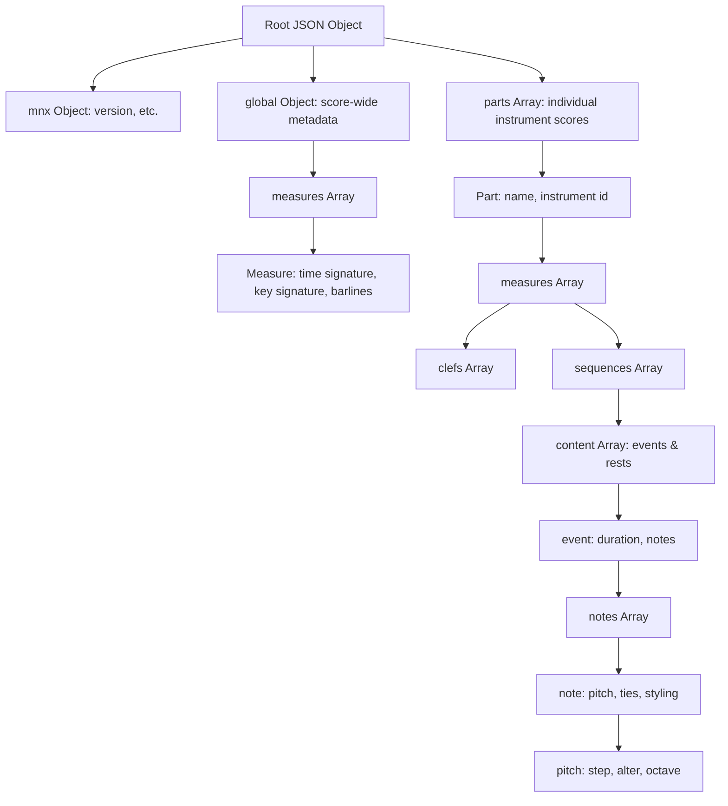

# W3C MNX Music Notation Format: Structure and Specification Research

## 1. Executive Summary

**MNX** (Music Notation Extended) is a next-generation, open standard for digital music notation developed by the **W3C Music Notation Community Group**—the same organization behind the industry-standard **MusicXML** and the SMuFL (Standard Music Font Layout) specifications.

Unlike MusicXML, which is XML-based and verbose, MNX is built natively on **JSON**. It is designed to be:
*   **Web-First**: Easy to parse and manipulate directly in JavaScript/TypeScript.
*   **Semantic**: Representing the *meaning* of the music (the "what") separate from its visual presentation (the "where").
*   **Reflowable**: Designed to fit different screen sizes dynamically rather than encoding fixed system breaks.
*   **Unambiguous**: Eliminating the multiple redundant ways of encoding the same musical structure that plague MusicXML.

This document researches the general structure of the latest preview version of MNX, shows how to represent musical features (including a 2-octave E Major scale), and explores how guitar-specific elements like bends, frets, and string numbers are mapped.

---

## 2. General Document Structure

An MNX file (conventionally using the extension `.mnx.json` or simply `.json`) is structured as a single JSON object. The top-level hierarchy separates metadata, score-wide events, and part-specific content.



### 2.1 The Root Level
The root JSON object contains the following keys:
*   `"mnx"`: Houses schema and metadata versioning (e.g., `{"version": 1}`).
*   `"global"`: Contains system-wide, timeline-level structures like key signatures, time signatures, barlines, and tempo changes.
*   `"parts"`: An array of objects representing individual voices or instruments.

### 2.2 The Global Object (`global`)
The `global` object maps parameters that apply across all parts simultaneously. This prevents the MusicXML redundancy where every instrument's measure has to repeat the current time signature.
*   `"measures"`: An array of objects corresponding to each bar.
    *   `"time"`: Time signature representation, e.g., `{"count": 4, "unit": 4}`.
    *   `"key"`: Key signature using fifths notation, e.g., `{"fifths": 4}` for E Major.
    *   `"barline"`: Type of barline, e.g., `{"type": "regular"}` or `{"type": "light-heavy"}`.

### 2.3 The Parts Object (`parts`)
An array of objects, one for each instrument or voice.
*   `"id"`: A unique identifier (e.g., `"part1"`).
*   `"name"`: The display name (e.g., `"Acoustic Guitar"`).
*   `"measures"`: An array of part-measure objects.
    *   `"clefs"`: An array of clef definitions applying to the staves (e.g., treble clef).
    *   `"sequences"`: A list of voices or tracks. In classical piano, you might have two sequences (upper and lower voice).
        *   `"content"`: An array of sequential musical events (notes and rests).
            *   `"duration"`: The duration of the event, specified as a fraction/base (e.g., `{"base": "quarter"}`).
            *   `"notes"`: An array of notes (multiple notes denote a chord).
                *   `"pitch"`: An object containing `"step"` (A-G), `"octave"` (0-9), and `"alter"` (-1 for flat, 1 for sharp).
            *   `"rest"`: Empty object `{"rest": {}}` used to indicate a rest instead of notes.

---

## 3. Two-Octave E Major Scale in MNX

Here is a concrete, syntactically valid MNX JSON representation of a **two-octave E Major scale** (ascending and descending) starting on E3 and ending on E3. It spans 8 measures of 4/4 time in quarter notes, with the final measure ending on a quarter note E3 and a dotted half rest.

The key signature of E Major has 4 sharps ($F\sharp, C\sharp, G\sharp, D\sharp$), which is represented as `"fifths": 4`. Note how the accidentals are encoded semantically in the pitch `"alter": 1` fields, but their visual rendering is governed by the key signature.

```json
{
  "mnx": {
    "version": 1
  },
  "global": {
    "measures": [
      {
        "key": { "fifths": 4 },
        "time": { "count": 4, "unit": 4 }
      },
      {},
      {},
      {},
      {},
      {},
      {},
      {}
    ]
  },
  "parts": [
    {
      "id": "guitar-part",
      "name": "Guitar",
      "measures": [
        {
          "clefs": [
            { "clef": { "sign": "G", "staffPosition": -2 } }
          ],
          "sequences": [
            {
              "content": [
                { "duration": { "base": "quarter" }, "notes": [ { "pitch": { "step": "E", "octave": 3 } } ] },
                { "duration": { "base": "quarter" }, "notes": [ { "pitch": { "step": "F", "alter": 1, "octave": 3 } } ] },
                { "duration": { "base": "quarter" }, "notes": [ { "pitch": { "step": "G", "alter": 1, "octave": 3 } } ] },
                { "duration": { "base": "quarter" }, "notes": [ { "pitch": { "step": "A", "octave": 3 } } ] }
              ]
            }
          ]
        },
        {
          "sequences": [
            {
              "content": [
                { "duration": { "base": "quarter" }, "notes": [ { "pitch": { "step": "B", "octave": 3 } } ] },
                { "duration": { "base": "quarter" }, "notes": [ { "pitch": { "step": "C", "alter": 1, "octave": 4 } } ] },
                { "duration": { "base": "quarter" }, "notes": [ { "pitch": { "step": "D", "alter": 1, "octave": 4 } } ] },
                { "duration": { "base": "quarter" }, "notes": [ { "pitch": { "step": "E", "octave": 4 } } ] }
              ]
            }
          ]
        },
        {
          "sequences": [
            {
              "content": [
                { "duration": { "base": "quarter" }, "notes": [ { "pitch": { "step": "F", "alter": 1, "octave": 4 } } ] },
                { "duration": { "base": "quarter" }, "notes": [ { "pitch": { "step": "G", "alter": 1, "octave": 4 } } ] },
                { "duration": { "base": "quarter" }, "notes": [ { "pitch": { "step": "A", "octave": 4 } } ] },
                { "duration": { "base": "quarter" }, "notes": [ { "pitch": { "step": "B", "octave": 4 } } ] }
              ]
            }
          ]
        },
        {
          "sequences": [
            {
              "content": [
                { "duration": { "base": "quarter" }, "notes": [ { "pitch": { "step": "C", "alter": 1, "octave": 5 } } ] },
                { "duration": { "base": "quarter" }, "notes": [ { "pitch": { "step": "D", "alter": 1, "octave": 5 } } ] },
                { "duration": { "base": "quarter" }, "notes": [ { "pitch": { "step": "E", "octave": 5 } } ] },
                { "duration": { "base": "quarter" }, "notes": [ { "pitch": { "step": "D", "alter": 1, "octave": 5 } } ] }
              ]
            }
          ]
        },
        {
          "sequences": [
            {
              "content": [
                { "duration": { "base": "quarter" }, "notes": [ { "pitch": { "step": "C", "alter": 1, "octave": 5 } } ] },
                { "duration": { "base": "quarter" }, "notes": [ { "pitch": { "step": "B", "octave": 4 } } ] },
                { "duration": { "base": "quarter" }, "notes": [ { "pitch": { "step": "A", "octave": 4 } } ] },
                { "duration": { "base": "quarter" }, "notes": [ { "pitch": { "step": "G", "alter": 1, "octave": 4 } } ] }
              ]
            }
          ]
        },
        {
          "sequences": [
            {
              "content": [
                { "duration": { "base": "quarter" }, "notes": [ { "pitch": { "step": "F", "alter": 1, "octave": 4 } } ] },
                { "duration": { "base": "quarter" }, "notes": [ { "pitch": { "step": "E", "octave": 4 } } ] },
                { "duration": { "base": "quarter" }, "notes": [ { "pitch": { "step": "D", "alter": 1, "octave": 4 } } ] },
                { "duration": { "base": "quarter" }, "notes": [ { "pitch": { "step": "C", "alter": 1, "octave": 4 } } ] }
              ]
            }
          ]
        },
        {
          "sequences": [
            {
              "content": [
                { "duration": { "base": "quarter" }, "notes": [ { "pitch": { "step": "B", "octave": 3 } } ] },
                { "duration": { "base": "quarter" }, "notes": [ { "pitch": { "step": "A", "octave": 3 } } ] },
                { "duration": { "base": "quarter" }, "notes": [ { "pitch": { "step": "G", "alter": 1, "octave": 3 } } ] },
                { "duration": { "base": "quarter" }, "notes": [ { "pitch": { "step": "F", "alter": 1, "octave": 3 } } ] }
              ]
            }
          ]
        },
        {
          "sequences": [
            {
              "content": [
                { "duration": { "base": "quarter" }, "notes": [ { "pitch": { "step": "E", "octave": 3 } } ] },
                { "duration": { "base": "half", "dots": 1 }, "rest": {} }
              ]
            }
          ]
        }
      ]
    }
  ]
}
```

---

## 4. Guitar-Specific Notation in MNX

Representing guitar specifics (tablature staves, string tuning, fret numbers, bends, and fingerings) is a crucial requirement for interactive editors. Because MNX is still an active community draft, its support for these elements is structured around a combination of core semantic definitions and built-in extensibility.

### 4.1 String Tuning & Tablature Staves
In standard music notation, a guitar score is typically rendered on a treble staff with an octavation symbol indicating that the pitches sound an octave lower than written (often called a treble G-clef with an "8" below it). In MNX:
*   **The Octave Clef**: A G-clef transposed down an octave is represented in the clef object by setting `"octave": -1` or choosing the appropriate clef sign.
*   **Tablature Staff Setup**: To render a 6-line tablature staff, the part configuration includes metadata describing the number of staff lines (6 lines) and the physical tuning of each string. 
    *   Guitar standard tuning (E2, A2, D3, G3, B3, E4) dictates the open pitch of each string, allowing rendering engines to automatically convert a semantic note (e.g., `{"step": "E", "octave": 3}`) to a fret and string combination if not explicitly annotated.

### 4.2 Fret and String Annotations (Tablature Semantics)
While standard classical music notation requires only pitch and duration, tablature requires instructions on *where* to play the pitch. The W3C Music Notation Group has discussed how to cleanly include string and fret mappings.

To represent tablature in MNX without breaking the standard schema, notes support a structured representation of technical elements. In MusicXML, this was done inside a `<technical>` element:
```xml
<!-- MusicXML representation -->
<technical>
  <string>6</string>
  <fret>12</fret>
</technical>
```

In **MNX**, the proposed representation links fret and string metadata directly to the `note` object. If standard attributes are still being finalized in the draft, MNX provides an explicit extension property (`_x`) for application-specific attributes.

An editor can implement guitar-specific attributes by embedding them inside the note block:

```json
{
  "pitch": { "step": "E", "octave": 3 },
  "technical": {
    "string": 6,
    "fret": 0
  }
}
```

### 4.3 Left-Hand and Right-Hand Fingerings
In classical guitar notation, left-hand fingerings are denoted by numbers (1 = index, 2 = middle, 3 = ring, 4 = pinky), while right-hand fingerings are denoted by letters (*p, i, m, a, c*).
*   **Left-Hand Fingering**: Associated with the individual `note` object (since two notes played at once will have different fingerings).
*   **Right-Hand Fingering**: Often attached to the `event` or the `note` to denote which finger plucks the string.
*   In MNX, these are mapped as semantic markings or text attachments connected to the specific note ID.

### 4.4 Pitch Bends, Hammer-ons, and Pull-offs
Guitar music relies heavily on expressive articulations:
1.  **String Bends**: A bend involves plucking a string and pushing it to raise the pitch. In notation, this has a starting note and a target pitch shift (e.g., a "full bend" is 2 semitones).
    *   In MNX, a bend is modeled as a notation direction spanning from a source note to a target, or as an articulation attached to the event.
    *   It contains a `semitones` or `alter` parameter (supporting decimals for microtonal bends, e.g., `1.5` semitones for a quarter-tone bend).
2.  **Hammer-ons and Pull-offs**: In music notation, these are represented visually by a slur curve over two notes played on the same string.
    *   MNX supports slurs using a `slurs` array in the measure, which contains `slur` objects referencing the `start` note ID and the `target` note ID.
    *   To specify that a slur is specifically a hammer-on or pull-off, it can be decorated with a `"type": "hammer-on"` or `"type": "pull-off"` flag.

### 4.5 Leveraging MNX Extensibility (`_x`) for Editor Specifics
A primary strength of JSON over XML is that validation engines can ignore properties they don't recognize while preserving them. The MNX specification explicitly reserves the `_x` key in all objects for vendor-specific extensions.

For our "AI-first mnx music editor," we can enrich the notes with precise guitar metadata today, knowing it is valid MNX:

```json
{
  "duration": { "base": "quarter" },
  "notes": [
    {
      "pitch": { "step": "G", "alter": 1, "octave": 3 },
      "_x": {
        "guitar": {
          "string": 3,
          "fret": 1,
          "fingering": {
            "hand": "left",
            "finger": "1"
          },
          "bend": {
            "type": "standard",
            "amount": 2.0,
            "release": false
          }
        }
      }
    }
  ]
}
```

---

## 5. Summary Matrix: MusicXML vs. MNX

| Feature | MusicXML | MNX (JSON) |
| :--- | :--- | :--- |
| **File Format** | XML (Heavy, Verbose) | JSON (Lightweight, Ergonomic) |
| **Parsing** | Requires complex DOM parsers | Built-in `JSON.parse()` in JS/TS |
| **Key/Time Signatures** | Repeated in every part-measure | Declared once in the `global` object |
| **Extensibility** | Rigid DTD/XSD schemas | Built-in `_x` extension block |
| **Relationships (Ties/Beams)** | Embedded child elements | Flat structures referencing unique IDs |
| **Guitar Tab Support** | Well-established `<technical>` tags | Draft status; extensible via custom models |
