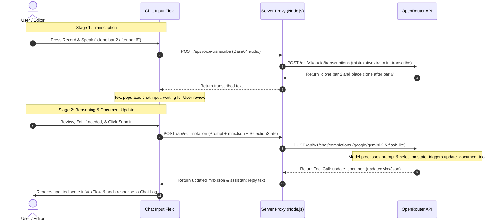

# OpenRouter Integration: Two-Stage Voice Input & Structured Notation Editing

This document defines the research, architecture, and API integration plan for the AI-first capabilities of the MNX Editor via **OpenRouter**. 

It details a **two-stage voice command workflow** utilizing transcription and structured document modification models, along with client-editor state sharing and tool/function calling schemas.

---

## 1. High-Level AI Architecture



---

## 2. Model Selection

We partition the workload into two specialized models:

| Role | Target Model (OpenRouter ID) | Rationale |
| :--- | :--- | :--- |
| **Transcription** | `mistralai/voxtral-mini-transcribe` | Highly optimized for short, conversational, and technical voice prompts. Low latency and high precision. |
| **Reasoning & Editing** | `google/gemini-2.5-flash-lite` | Excellent reasoning capabilities, large context window to ingest MNX documentation, fast response, low cost, and native support for Structured Outputs (JSON Schema) and Function Calling (Tools). |

---

## 3. Stage 1: Transcription Pipeline

### 3.1 Recording and Capturing Audio
In the browser, we capture voice commands using the native **MediaRecorder API**:
- **Format**: `audio/webm` or `audio/wav`.
- **Target Duration**: Typically under 10 seconds.
- **Workflow**:
  1. User holds a microphone button next to the chat input (e.g., `<wa-button circle><wa-icon name="mic"></wa-icon></wa-button>`).
  2. Recording starts. On release, the recorded blob is converted to base64.
  3. Send to Server Proxy.

### 3.2 OpenRouter Transcription API Request
The proxy forwards the audio payload to OpenRouter:

```http
POST https://openrouter.ai/api/v1/audio/transcriptions HTTP/1.1
Authorization: Bearer YOUR_OPENROUTER_KEY
Content-Type: multipart/form-data

file: [Audio Blob/File]
model: mistralai/voxtral-mini-transcribe
```

### 3.3 Two-Stage Submission UX
To prevent errant AI actions from voice misinterpretations:
1. The returned text (e.g., *"clone bar 2 and place clone after bar 6"*) is placed directly into the input text area of `<mnx-chat-panel>`.
2. The cursor focus is moved to the text area.
3. The user can tweak spelling, fix musical terms (e.g., correcting "F sharp" if transcribed as "effective"), and press **Enter** (or click Send) to submit.

---

## 4. Stage 2: Music Editing & Tool Calling Pipeline

When the user submits the text instruction, the client sends three payloads to the backend:
1. **User Instruction**: The transcribed/typed text.
2. **Current Document**: The active W3C `mnx.json` document.
3. **Editor Selection Context**: Information about what the user is currently editing or looking at.

### 4.1 Editor Selection Context Schema
This context allows the model to understand relative directives (e.g., "delete *this* note", "transpose *this* bar", "add C major chord to *part 1*").

```json
{
  "selectionContext": {
    "activePartId": "guitar-part",
    "activeMeasureIndex": 1, 
    "activeVoiceIndex": 0,
    "activeEventIndex": 3,
    "selectedNoteIds": ["note-e3-1"],
    "playerPlayheadTime": 4.5
  }
}
```

### 4.2 Prompt Template
The prompt wrapper instructs the LLM on its behavior and parameters:

```text
You are an expert music notation editor. Your task is to modify the W3C MNX JSON document based on the user's instructions.

System Context:
- Current W3C MNX Document is supplied in full.
- The editor selection state indicates what note, bar, or voice the user is focusing on.

Rules:
1. Ensure all modifications produce semantically valid MNX JSON.
2. If the user refers to relative elements ("this note", "here", "the selected measure"), use the selectionContext to resolve the reference.
3. You must execute your updates using the provided tools.
```

---

## 5. Tool / Function Calling Definitions

To ensure output format integrity, the model must interact with the document via structured tools rather than raw text blocks.

### 5.1 Initial Tool: `update_document`
A single tool that updates the entire document. This is ideal for initial, minimal implementation.

```json
{
  "name": "update_document",
  "description": "Replaces the active MNX JSON document with a new, modified version.",
  "parameters": {
    "type": "object",
    "properties": {
      "explanation": {
        "type": "string",
        "description": "Brief description explaining what changes were made (e.g. 'Transposed measure 2 up by 2 semitones')"
      },
      "mnxJson": {
        "type": "object",
        "description": "The complete, updated W3C MNX JSON document."
      }
    },
    "required": ["explanation", "mnxJson"]
  }
}
```

### 5.2 Future Finer-Grained Tools (Organic Growth)
As the app scales, sending the entire document for minor edits becomes inefficient. We will introduce granular tools to target specific parts of the JSON array:

#### Tool: `update_measure`
Updates content in a single measure.

```json
{
  "name": "update_measure",
  "description": "Updates the events/notes sequence of a single measure inside a part.",
  "parameters": {
    "type": "object",
    "properties": {
      "partId": { "type": "string" },
      "measureIndex": { "type": "integer" },
      "sequenceIndex": { "type": "integer" },
      "content": {
        "type": "array",
        "description": "The new array of events and rests for this sequence.",
        "items": { "type": "object" }
      }
    },
    "required": ["partId", "measureIndex", "sequenceIndex", "content"]
  }
}
```

#### Tool: `insert_note`
Inserts a note or chord at a specific position.

```json
{
  "name": "insert_note",
  "description": "Inserts a new note event at a specific index in a measure sequence.",
  "parameters": {
    "type": "object",
    "properties": {
      "partId": { "type": "string" },
      "measureIndex": { "type": "integer" },
      "sequenceIndex": { "type": "integer" },
      "insertIndex": { "type": "integer" },
      "duration": {
        "type": "object",
        "properties": {
          "base": { "type": "string" }
        }
      },
      "pitches": {
        "type": "array",
        "items": {
          "type": "object",
          "properties": {
            "step": { "type": "string" },
            "octave": { "type": "integer" },
            "alter": { "type": "integer" }
          }
        }
      }
    },
    "required": ["partId", "measureIndex", "sequenceIndex", "insertIndex", "duration", "pitches"]
  }
}
```

---

## 6. Server Proxy Implementation Draft (OpenRouter Client)

To securely query OpenRouter without leaking API keys to the frontend, a Node.js Express proxy executes the API calls:

```javascript
import express from 'express';
import fetch from 'node-fetch';

const router = express.Router();

router.post('/api/edit-notation', async (req, res) => {
  const { userPrompt, mnxJson, selectionContext } = req.body;

  const messages = [
    {
      role: 'system',
      content: `You are a music notation engine. Update the MNX score. Selection Context: ${JSON.stringify(selectionContext)}`
    },
    {
      role: 'user',
      content: `Current MNX Score:\n${JSON.stringify(mnxJson, null, 2)}\n\nUser Instruction:\n${userPrompt}`
    }
  ];

  const tools = [
    {
      type: 'function',
      function: {
        name: 'update_document',
        description: 'Update the MNX JSON score.',
        parameters: {
          type: 'object',
          properties: {
            explanation: { type: 'string' },
            mnxJson: { type: 'object' }
          },
          required: ['explanation', 'mnxJson']
        }
      }
    }
  ];

  try {
    const response = await fetch('https://openrouter.ai/api/v1/chat/completions', {
      method: 'POST',
      headers: {
        'Authorization': `Bearer ${process.env.OPENROUTER_API_KEY}`,
        'Content-Type': 'application/json',
        'HTTP-Referer': 'https://mnx-editor.dev',
        'X-Title': 'MNX Music Editor'
      },
      body: JSON.stringify({
        model: 'google/gemini-2.5-flash-lite',
        messages,
        tools,
        tool_choice: { type: 'function', function: { name: 'update_document' } } // Force document update tool
      })
    });

    const data = await response.json();
    
    // Parse the tool call arguments from OpenRouter's response
    const toolCall = data.choices[0].message.tool_calls[0];
    const argumentsObj = JSON.parse(toolCall.function.arguments);

    res.json({
      success: true,
      explanation: argumentsObj.explanation,
      updatedMnxJson: argumentsObj.mnxJson
    });
  } catch (error) {
    res.status(500).json({ success: false, error: error.message });
  }
});

export default router;
```
