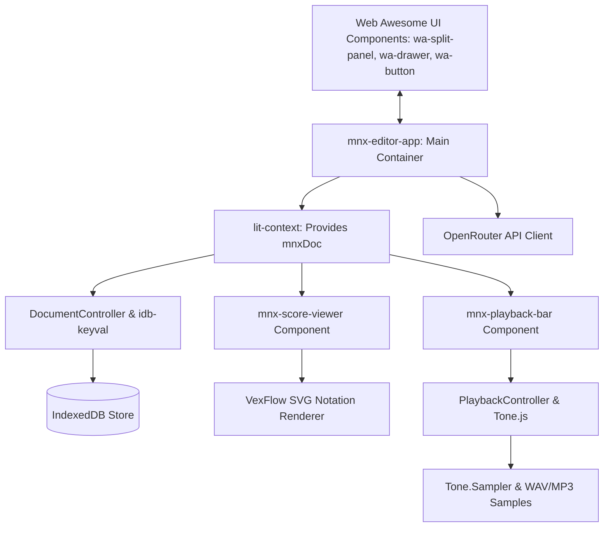

# Unified Tech Stack & Architecture for the Lit-Only MNX Music Editor

## 1. Introduction & Core Philosophy

This document defines the official, locked-in **tech stack** and **software architecture** for the AI-first MNX music editor. 

We have chosen a **100% pure Lit / Web Components** approach. The application will not use React, Vue, or third-party state libraries like Zustand. Instead, the editor leverages native Web APIs, Lit Reactivity, and DOM-based protocols.

This approach provides three critical advantages:
1.  **Zero-Framework Embeddability**: The compiled editor outputs as a native custom element (`<mnx-editor>`). It can be embedded in any third-party website (static HTML, WordPress, React, Vue, Svelte) via a single `<script>` tag.
2.  **Shadow DOM Style Isolation**: Styles from the hosting page cannot leak in and corrupt the SVG rendering lines of VexFlow.
3.  **High Performance & Small Footprint**: Lit is extremely fast and lightweight (~5KB gzipped), keeping load times minimal for embedded instances.

---

## 2. Core Architecture

The entire application relies on a modular, decoupled architecture where rendering, playback, storage, and AI are separated by clean interfaces.



### 2.1 Technology Stack Summary

| Layer | Technology | Rationale |
| :--- | :--- | :--- |
| **Framework** | **Lit (HTML, CSS, JS/TS)** | Fast, lightweight library for building standard Web Components. Exposes native lifecycles and reactive properties. |
| **UI Components** | **Web Awesome (Shoelace)** | Framework-agnostic, customizable web components (`wa-` elements) that provide premium sliders, split panels, buttons, and drawers. |
| **State Distribution** | **`@lit/context`** | Implements the W3C Context Protocol. Shares the active MNX score across the component tree without prop drilling. |
| **Stateful Logic** | **Lit `ReactiveController`** | Encapsulates stateful logic (like DB saving or Tone.js timeline triggers) into clean lifecycle-aware controller classes. |
| **Database & Cache**| **`idb-keyval`** | Under 1KB wrapper for IndexedDB. Provides asynchronous, promise-based local persistence. |
| **Visual Rendering** | **VexFlow (v5)** | Industry-standard library for browser music notation. Instantiated inside the Shadow DOM container. |
| **Audio Synthesis** | **Tone.js + Audio Samples** | Professional Web Audio framework for precise scheduling, paired with sampled acoustic guitar/piano audio files. |
| **AI Integration** | **OpenRouter API** | Provides access to top-tier LLMs (Gemini, Claude, GPT) using JSON Schema Structured Outputs to guarantee valid MNX formats. |
| **Styling & Theming** | **Vanilla CSS + OKLCH custom tokens** | Styled with CSS Custom Properties to enable dark-mode glassmorphic aesthetics. |

---

## 3. Data Flow & State Management

State is managed locally in the DOM tree, avoiding the overhead of external state libraries.

1.  **Scoping (Downward Flow)**: The root `<mnx-editor-app>` provides the current `MnxDocument` context using `@lit/context`'s `@provide` decorator. Any children (e.g. `<mnx-score-viewer>`) consume this context using `@consume({ subscribe: true })`. Whenever the score updates, all consumer components re-render automatically.
2.  **Actions (Upward Flow)**: Child components do not modify the state directly. They emit standard DOM custom events, which bubble up. For example, clicking a notehead emits a `score-changed` custom event:
    ```typescript
    this.dispatchEvent(new CustomEvent('score-changed', {
      detail: { mnxJson: updatedJson },
      bubbles: true,
      composed: true // Crucial: Allows event to bubble out of the Shadow DOM
    }));
    ```
3.  **Side Effects**: The root component intercepts these events and updates the state. The `DocumentController` automatically intercepts state updates and debounces a call to IndexedDB.

---

## 4. Storage & Persistence Abstraction

To ensure local files can eventually sync with the cloud (e.g., Supabase/Firestore), we decouple database operations behind a standard repository interface.

### 4.1 Document Repository API
```typescript
export interface MnxDocument {
  id: string;
  name: string;
  lastUpdated: number;
  mnxJson: any; // Raw W3C MNX JSON
}

export interface DocumentRepository {
  load(id: string): Promise<MnxDocument | null>;
  save(doc: MnxDocument): Promise<void>;
  delete(id: string): Promise<void>;
  list(): Promise<Omit<MnxDocument, 'lastUpdated'>[]>;
}
```

### 4.2 Local Persistence Engine (`idb-keyval`)
We implement this interface locally using `idb-keyval` for fast local IndexedDB storage.
*   *Key benefit*: The repository can be swapped to a `CloudRepository` down the line without changing a single line of UI code in the Lit components.

---

## 5. Visual Notation & Audio Playback inside Shadow DOM

### 5.1 VexFlow in Shadow DOM
VexFlow renders inside the isolated Shadow Root:
*   We render a container `<div class="score-container"></div>` inside our component's template.
*   In the `firstUpdated()` Lit hook, we query the node: `const el = this.shadowRoot.querySelector('.score-container')`.
*   We feed `el` to the `Vex.Flow.Factory`.
*   Shadow DOM isolates VexFlow's SVGs from the host page's CSS, ensuring perfect visual rendering.

### 5.2 Tone.js Playback Engine
Audio operations are encapsulated in a `PlaybackController`:
*   Hooks into the component lifecycle (`hostConnected`, `hostDisconnected`).
*   Requires a user interaction to trigger `await Tone.start()`, satisfying browser autoplay blocks.
*   Synthesizes notes using a preloaded sampler (e.g. Steinway Piano or Stratocaster) and coordinates with an SVG line on the canvas to serve as the visual playhead.

---

## 6. AI-First Bridge via OpenRouter

The AI features use **OpenRouter** to query LLMs (Gemini, Claude, GPT).
*   **Structured Outputs**: We supply the official MNX JSON schema in the request's `response_format`. OpenRouter ensures the model returns valid MNX JSON, eliminating generation syntax errors.
*   **Proxy Endpoint**: A thin Node/Express backend or edge function proxies client requests to OpenRouter securely, protecting API keys.
*   **Interactive Editing**: Prompts include the current MNX state + user request. The returned MNX JSON is updated via the `score-changed` event, triggering immediate re-renders of the score.

---

## 7. Unified Project Structure

```text
mnx-editor/
├── public/
│   ├── samples/             # Audio instrument samples (Acoustic Guitar, Piano)
│   └── favicon.ico
├── src/
│   ├── components/          # Lit Web Components (Self-contained)
│   │   ├── MnxEditorApp.ts  # Root element, split-panels, AI chat drawer, providers
│   │   ├── ScoreViewer.ts   # Wraps VexFlow inside the Shadow DOM, captures note clicks
│   │   └── PlaybackBar.ts   # Audio controller trigger, tempo slider, volume controls
│   ├── contexts/
│   │   └── mnxContext.ts    # @lit/context keys for score and playback sharing
│   ├── controllers/
│   │   ├── DocumentController.ts # Coordinates loading, saving, debounced IDB syncs
│   │   └── PlaybackController.ts # Coordinates Tone.js initialization and transports
│   ├── types/
│   │   ├── mnx.ts           # Types matching the MNX specification
│   │   └── repository.ts    # Repository interfaces
│   ├── utils/
│   │   ├── mnxToVexflow.ts  # Bridge: MNX JSON -> VexFlow drawing calls
│   │   ├── mnxToAudio.ts    # Bridge: MNX JSON -> Tone.js schedule triggers
│   │   └── indexedDbRepository.ts # DocumentRepository implementation via idb-keyval
│   ├── index.css            # Custom properties overrides (OKLCH, Fonts, Glassmorphism)
│   └── main.ts              # Custom element registration and CSS bootstrap
├── server/                  # Proxy server for OpenRouter completions
│   ├── index.js
│   └── package.json
├── package.json
├── tsconfig.json
└── vite.config.ts
```

---

## 8. Summary of Major Decision Points

1.  **VexFlow & Shadow DOM**: Resolved querying issues by using element references (`this.shadowRoot`) instead of ID strings. Styling is isolated cleanly.
2.  **No React Wrapper**: The application compiles directly into a native Web Component.
3.  **No Zustand**: Replaced with native Lit Contexts (`@lit/context`) and Reactive Controllers.
4.  **Local storage**: Resolved IndexedDB complexity by using `idb-keyval`, structured under a swap-ready `DocumentRepository` interface.
5.  **UI Library**: Locked in **Web Awesome (Shoelace)**, styled using custom CSS variables for premium dark-mode aesthetics.
